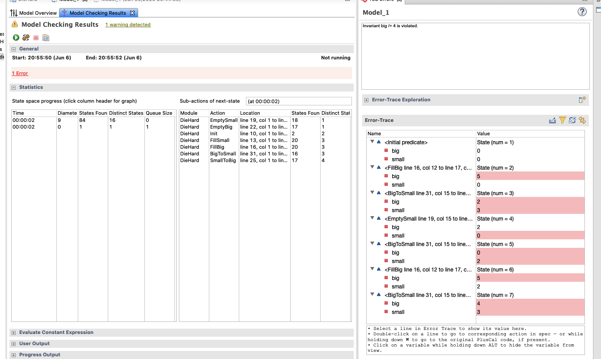

```tla


------------------------------ MODULE DieHard ------------------------------

EXTENDS Integers

VARIABLES small, big

TypeOK == /\ small \in 0..3
          /\ big \in 0..5
 
Init == /\ big = 0
         /\ small = 0

FillSmall == /\ small' = 3 
             /\ big' = big

FillBig == /\ big' = 5
           /\ small' = small
           
EmptySmall == /\ small' = 0
               /\ big' = big
                                                  
EmptyBig == /\ big' = 0
            /\ small' = small
            
SmallToBig == IF big + small <= 5
              THEN /\ small' = 0
                   /\ big' = big + small
              ELSE /\ big' = 5
                   /\ small' = big + small - 5 

BigToSmall == IF big + small <= 3
                THEN /\ big' = 0
                     /\ small' = big + small
              ELSE /\ small' = 3
                   /\ big' = big + small - 3
                   
Next == \/ FillSmall 
        \/ FillBig
        \/ EmptySmall
        \/ EmptyBig
        \/ SmallToBig
        \/ BigToSmall        
                                                                          
=============================================================================
\* Modification History
\* Last modified Sat Jun 06 20:46:05 JST 2020 by kv
\* Created Sat Jun 06 20:13:22 JST 2020 by kv


```


今天跟着 [Leslie Lamport 的视频](https://www.youtube.com/watch?v=IW0oA3Pxe-Q&list=PLWAv2Etpa7AOAwkreYImYt0gIpOdWQevD&index=4)，学习了 TLA+。 很久之前都知道这个工具， 也尝试过几次， 但是每次皆是未得法门， 失败告终。 偶然在 Twitter 上看到有人发的[推](https://twitter.com/xxuejie/status/1269132460165492736)， 说 

> Without a doubt, TLA+ is really the best thing I've grasped in years. It fundamentally changed how I view software design vs software implementation.

让我不禁想再次尝试。 这次直接从 Leslie Lamport 的主页入手，看了视频， 下了工具，了解了大概用法（之前都不知道怎么玩）， 并且完成了一个例子（上述代码是独立完成， 并且能执行）。其中有点意思的是， 可以故意设置错误的条件，然后让 TLA+  toolbox 输出具体的步骤。 





有 3 加仑、5 加仑的壶， 怎么才能装 4 加仑的水？ 程序上可以验证正确的， 为了找到一个具体迁移过程， 可以设置一个错误的不变量， big /= 4, 这样， Model 验证会出错， 且会显示一个 big = 4 的过程：

         +-----------+
         | big = 0   |
         | small = 0 |
         +-----------+
              |
              |
              v
         +-----------+
         | big = 5   |
         | small = 0 |
         +-----------+
              |
              |
              v
         +-----------+
         | big = 2   |
         | small = 3 |
         +-----------+
              |
              |
              v
         +-----------+
         | big = 2   |
         | small = 0 |
         +-----------+
              |
              |
              |
              v
         +-----------+
         | big = 0   |
         | small= 2  |
         +-----------+
              |
              |
              v
         +-----------+
         | big = 5   |
         | small = 2 |
         +-----------+
              |
              |
              v
         +-----------+
         | big = 4   |
         | small = 3 |
         +-----------+


interesting! 很有趣吧。


准备继续探索， 期望能用这个工具优化并发程序的设计

